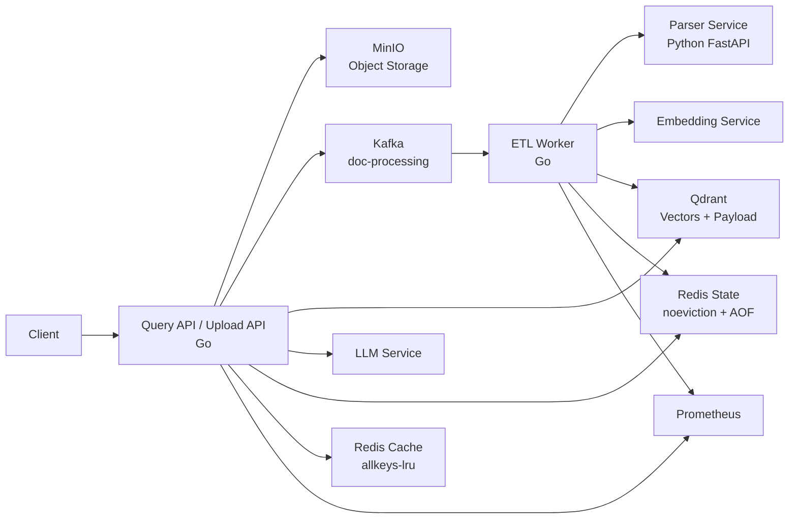

# Interview Pack（基于真实评测数据）

> 本材料基于 `docs/evals/real-baseline-findings.md`、`docs/evals/experiments.md` 的真实数据。
> 所有数字均为真实模型（nomic-embed-text 768d + deepseek-v4-flash）在语义数据集上的实测。

## 1. 项目一句话

一个面向企业文档的 AI ETL/RAG 平台：Kafka 异步处理文档 → Parser 解析切块 → Embedding 向量化 → Qdrant/ES 混合检索 → LLM 生成回答。区别于普通 RAG demo 的是——我用一套**可复现的评测体系**量化了检索质量，用它发现了多个真实缺陷（幻觉拒答、ES 时序误报、英文 reranker 对中文负优化），并逐一用数据支撑的方式修复。

## 2. 十句话速览

1. 架构：上传 → Kafka → worker → parser → embed → Qdrant/ES → query-api → LLM
2. 可靠性：成功才 Ack、失败重试、DLQ 先写后 Ack、Redis checkpoint、熔断器
3. 分布式正确性：fencing token 锁、乐观版本号、幂等键、审批补偿
4. 评测双模式：mock（CI 门禁）+ 真实模型（质量度量），报告标注模式
5. **核心发现**：锚点集的 100% 是假象；真实评测发现 nomic-embed-text 下 Recall@1 仅 19%，换 bge-m3 后提升到 71%
6. 缺陷修复：无证据拒答（负样本 0→6/6）、断言去 mock 化、ES 时序误报
7. 实验决策：hybrid 保留（ES 净增益 +7 例）、**英文 reranker 对中文有害应关闭**
8. 方法论：抖动基线（4.26% 显著性下限）保证实验差异不是噪声
9. 成本可观测：token/成本指标 + 评测报告含单次查询成本
10. 工程化补充：SSE 流式、演示前端、prompt 版本管理、Agent native tool calling

## 3. 10 分钟讲解稿

### 0:00-1:30 背景与三个真实问题

企业文档问答不能只追求「能回答」。真正的问题有三个：文档处理不能丢（可靠性）、结果必须守边界（租户/权限）、**质量必须能量化**（否则无法判断改得好不好）。最后一点是我投入最多的地方——大多数 RAG 项目宣称的高分经不起追问。

### 1:30-3:00 架构与可靠性

主链路 `upload → Kafka → worker → parser → embed → Qdrant → query-api → LLM`。可靠性原则「成功才 Ack、失败重试、DLQ 先写后 Ack」。分布式正确性用 fencing token（单调递增，防止陈旧写入被接受）。

### 3:00-5:00 评测方法论（重点）

我建立了双模式评测：

- **mock 模式**（CI 门禁）：确定性、免费，验证链路接通
- **真实模式**：真实 embedding + LLM，唯一能说明质量的模式

**关键教训：mock 的 100% 是假象。** 锚点数据集每条 query 内嵌 `alpha001` 这类 token，路由器判定为精确匹配，语义检索路径从未执行。换真实模型 + 语义数据集后，Recall@1 从 86% 掉到 **19%**——评测保真度决定一切后续优化的可信度。随后我用同样数据集对比 embedding 选型：**nomic-embed-text → bge-m3 后，Recall@1 从 19% 提到 71%，Recall@5 到 95%**——embedding 的语义分辨率是检索质量的决定性因素。

### 5:00-7:00 用评测发现并修复缺陷

**幻觉拒答（最严重）**：权限负例（confidential 文档 + user 角色）中，检索挡住了目标文档，但 LLM 仍基于无关文档编造答案。根因是拒答兜底条件 `len(sources)==0` 永不触发——权限过滤后仍有无关文档。修复分两层：prompt 明确「文档不足只回复固定拒答句」，并保留相关性门控（阈值因分布重叠暂缓）。负样本从 0/3 修到 6/6。

**过程中我引入过一次回归并修复**：第一版 prompt 把「标注来源」写成格式要求，模型只输出来源行、丢掉答案，正样本从 35 掉到 24。改成「先给答案，再标注来源」后恢复。这证明了**一次一变量的价值**——如果同时改多处，无法归因指标变化。

### 7:00-8:30 用实验做配置决策

两个对照组实验：

- **ES 混合检索**：关 ES 后 pass_rate 从 69% 掉到 52%。ES BM25 对中文有真实增益（+7 例），hybrid 保留。
- **英文 reranker**：关 rerank 后 pass_rate 从 69% 升到 74%。`ms-marco-MiniLM`（英文训练）对中文语义检索**零帮助还略微有害**——0 例受益、2 例受害。结论：当前应关闭，或换中文 reranker。

两者差异都超过抖动基线（4.26%），是真实信号。

### 8:30-10:00 工程化补充与结果

补充了 SSE 流式、演示前端、prompt 版本管理、Agent native tool calling、token/成本观测。测试规模：19 个 Go 包 + 25 项 Python 单测。

**结果不是「100%」**，而是：语义集（bge-m3）Recall@1 71%、@5 95%、负样本 6/6、pass_rate 93%。这是一条完整的质量改进路径：评测先暴露 nomic 的 19%，embedding 选型把它提升到 71%。

## 4. 失败复盘（面试官最爱问）

### 复盘一：mock 评测掩盖了幻觉缺陷

F-01 的幻觉 bug 在 mock 下永远显示通过，因为 mock 服务器遇到锚点不匹配会主动输出拒答话术，把缺陷伪装成正常。直到换真实模型才暴露。**教训：mock 只适合验证链路，不适合断言质量。**

### 复盘二：评测脚本自身的时序缺陷

三个稳定失败的 case 经诊断，根因不是系统 bug，而是评测脚本在 ES 最终一致性同步完成前就开始查询。exact 路由 ES 权重 0.75，ES 未同步时目标文档被挤出 top5。手动调用系统、加诊断延迟重跑都证明系统正常。**教训：评测工具本身也会引入假信号，「稳定失败」不一定是系统缺陷。**

### 复盘三：prompt 格式要求被模型误读

第一版拒答 prompt 的「标注来源」被读成输出格式规定，模型只输出 `来源: case-002` 丢答案。**教训：安全约束要双向——只说「不确定就拒答」会过度拒答，要配「有依据必须作答」；格式要求要说清是附加而非替代。**

## 5. 常见追问与回答

### 你的检索质量怎么量化的？

双模式评测：CI 用 mock（确定性门禁），质量用真实模型 + 语义数据集（Recall/MRR）。语义集 42 例，query 口语化改写不直接复用文档词，测语义理解而非关键词匹配。`validate_eval_dataset.py` 会拦截 query-content 重叠过高的「伪语义」用例。

### 你的 Recall@1 怎么从 19% 提到 71% 的？

先评测暴露问题：nomic-embed-text（137M）对中文口语 query 理解有限，语义集 Recall@1 只有 19%。然后用同一数据集对比 embedding 选型，**换 bge-m3（中文优化，1024 维）后 Recall@1 到 71%、@5 到 95%**。这说明 embedding 的语义分辨率是检索质量的压倒性因素——策略调优（rerank、权重）只是微调，embedding 选型决定上限。

### 你怎么判断一个实验改动是有效的？

先量化抖动基线：同配置连跑 3 轮，pass_rate 自然波动 4.26%。任何实验差异低于该值都算噪声。两个实验（ES on/off、rerank on/off）的差异都远超基线，结论可信。

### 你的 reranker 为什么关闭了？

实验数据显示：当前 `ms-marco-MiniLM`（英文 Cross-Encoder）对中文语义检索 0 例受益、2 例受害，pass_rate 下降 4.76%。不是 reranker 机制没用，是模型语言错配。exact-match pinning 保护（不依赖模型）仍独立工作。正确做法是换中文 reranker（bge-reranker-v2-m3）后重测。

### 你的 durable run 存在一个 LRU 淘汰的 Redis 里，怎么保证 durable？

不能保证——这是我在架构审计中发现的问题（ADR 0004）。`allkeys-lru` 会淘汰任意 key，包括 fencing token。已拆成两个实例：`redis-cache`（LRU，只放语义缓存）和 `redis-state`（noeviction + AOF，放 Agent 状态、审批、幂等、checkpoint）。生产校验拒绝两者指向同一实例。

### 你会怎么改进检索质量？

三个方向，按优先级：换更大的中文 embedding（bge-m3）、检索前 query 改写（口语→书面）、中文 reranker。每一项都要过抖动基线验证。

## 6. 架构图

## 7. 关键数字

| 维度 | 数字 | 说明 |
| --- | --- | --- |
| 语义集 Recall@1 / @5 | 71% / 95% | bge-m3，真实模型 |
| 负样本拒答 | 6/6 | 修复后 |
| 抖动基线 | 4.26% | pass_rate 自然波动 |
| ES 关 vs 开 | 52% vs 69% | hybrid 保留 |
| rerank 关 vs 开 | 74% vs 69% | 英文 rerank 有害 |
| 测试规模 | 19 Go 包 + 25 Python | 全绿 |
| 评测模式 | mock + real | 报告标注 |
